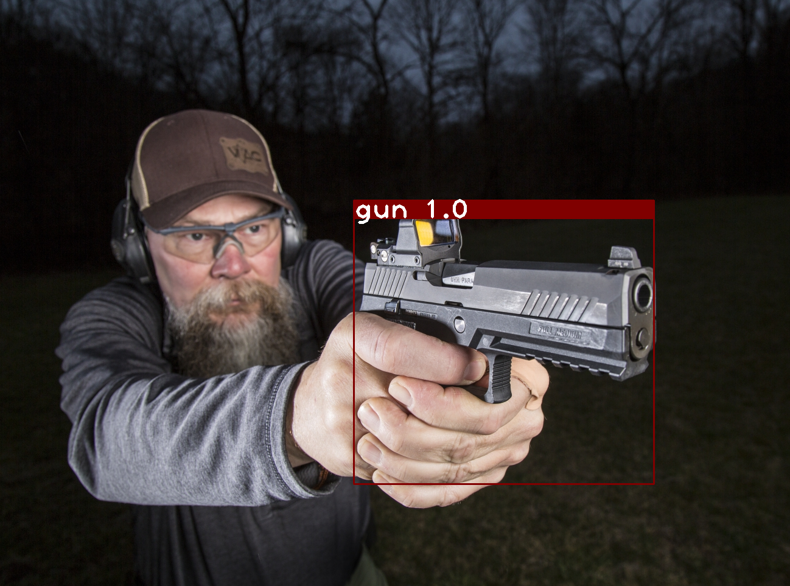
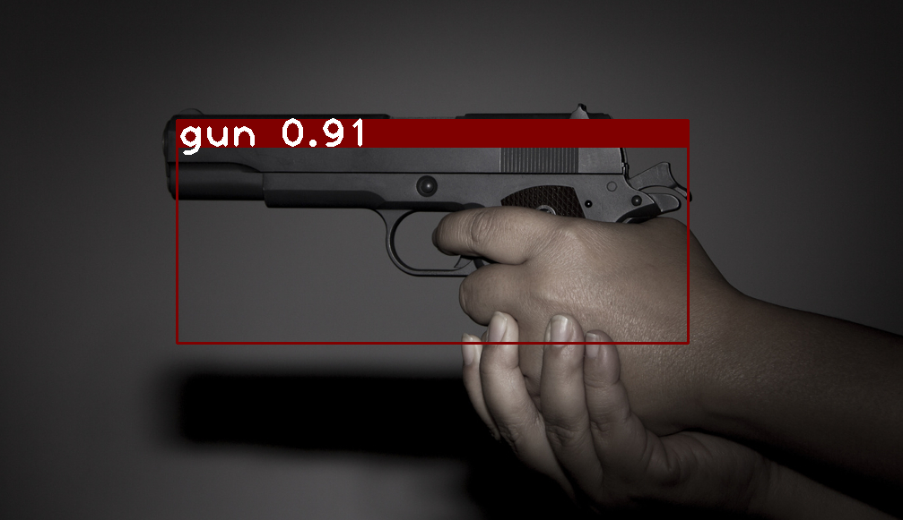
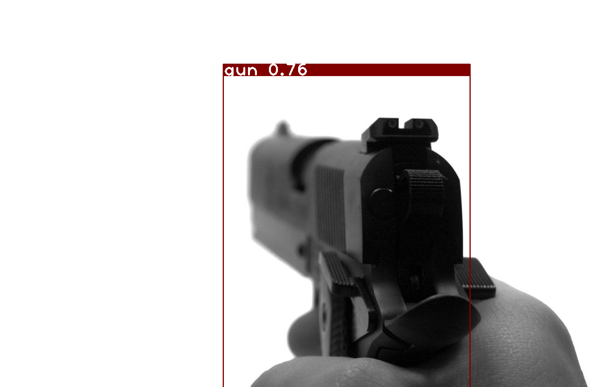
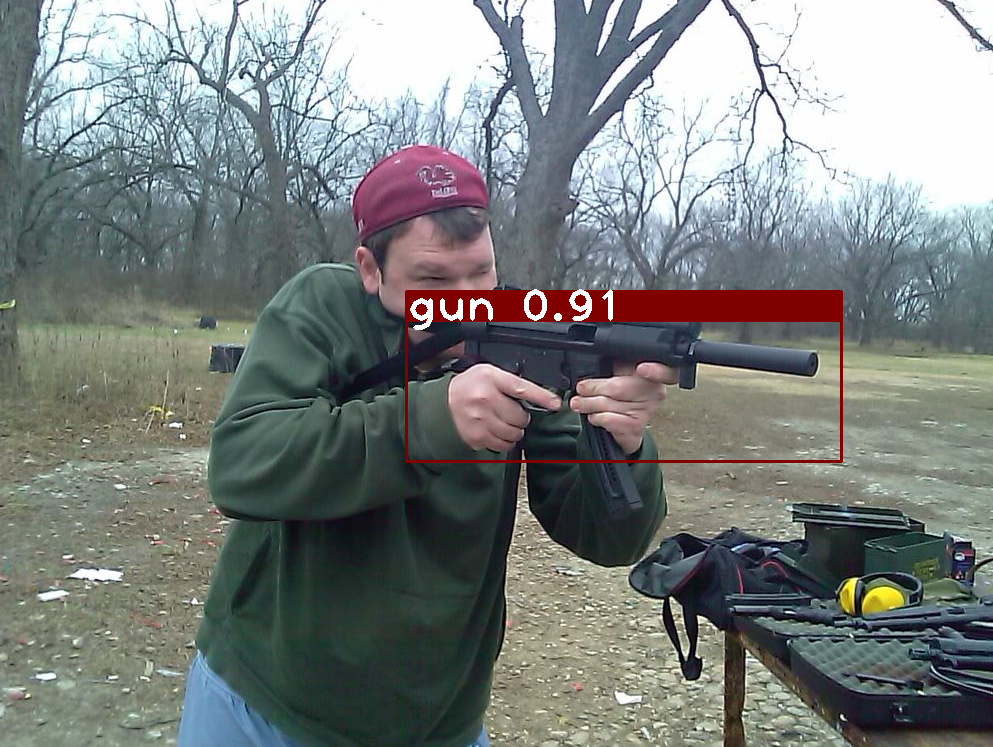

# Suspect Detection

Real-time suspect detection using [Face Recognition](https://github.com/ageitgey/face_recognition) and detecting the weapon using 
[YOLOv3](https://pjreddie.com/darknet/yolo/); you can download the weight file from [here](https://drive.google.com/file/d/1442BIaaBQX_08igaf0oewOPC3NHwsvfk/view?usp=sharing)

- Detection of weapon (gun) in an image and in real-time
- Detection of suspicious person

<p align="center">   </p>

<p align="center">  </p>


## Model training

1. Gun detection model is trained using the pretrained [YOLOv3](https://pjreddie.com/darknet/yolo/) model; 
all of the images were collected from the internet and can be downloaded from 
[here](https://drive.google.com/drive/folders/1A__o3rC-y4RUhM7l_M1_ygSr7_pnHk9l?usp=sharing) (if you wish to train your own model).

2. Suspect model is trained using python [face_recognition](https://github.com/ageitgey/face_recognition) library; the current model is trained using 
specific personel images only.   


## Dependencies

```
pip install 

  face-recognition
  opencv-python
  numpy
  vidstream
  imutils
  dlib
```

## How to run 

To run the gun detection model (images):

```
python gun_detection.py --image images/armas_767.jpg
```

To run the gun detection file in real-time:

```
python realtime_gun_detection.py
```

To run the suspect detection model:

```
python suspect_detection.py --encodings encoding.pickle
```
 


### How to train your own Suspect Detection model

To train your suspect detection model using your own set of images:

1. collect the images of the people you want to include in the non-suspected person's list
2. collect approx. 50-100 images per person
3. follow the following hierarchy to store the images:

```shell
├── face_recg_dataset
    ├── NAME_OF_A_PERSON_1
        ├── images.jpg
        └── ...
    ├── NAME_OF_A_PERSON_2
        ├── images.jpg 
        └── ...
    ...
    ... 
```

4. Once you have collected the images, now you need to train the model using ```train_face_recognize.py```

```
python train_face_recognize.py --dataset face_recg_dataset --encodings encodings.pickl
```

5. When training is complete, you will see encodings.pickl saved in your project directory
6. Now you can replace this file when calling ```suspect_detection.py``` file

```
python suspect_detection.py --encodings YOUR_ENCODER_FILE.pickle
```


